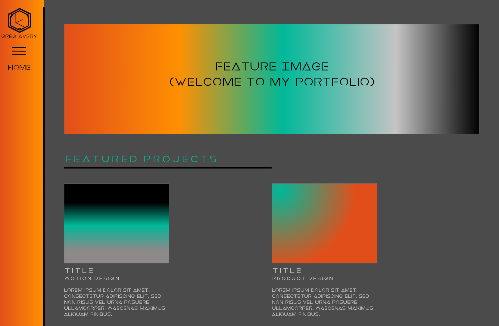

# FIP Portfolio

### Overview
This is my portfolio website. Inside it, you can find various projects that I have worked on within the IDP course at Fanshawe. These projects are focussed on motion design, product design, and developing. Along with the home and gallery pages, there is also an about page which has information about my interests and skills. 

### Getting Started
This is an HTML / SASS / js / AJAX build.

To view the page, clone this to the location of your choice, and open the "index.html" file to start at the home page.

You can also view the source code by opening it in any code editing program of your choice, or clicking inspect in a chrome tab.

### Prerequisites
All you need to run this page is an up to date browser.

## Authors
1. Greg Avery - developer / designer
